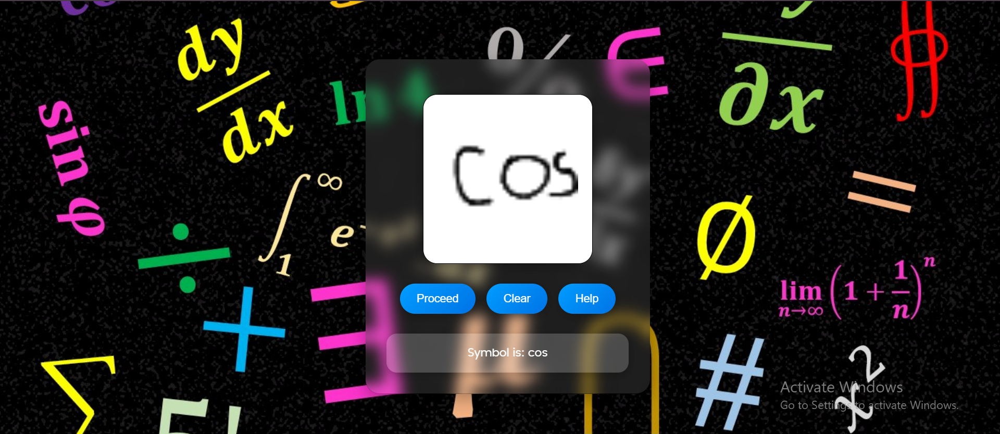

<h1># 🧠 HSR Project — Handwritten Symbol Recognition</h1>

## 🖼️ Demo Preview

  

---

## 🧩 About the Project

The **Handwritten Symbol Recognition (HSR)** system is a full-stack AI application that identifies handwritten mathematical symbols in real time.
Users can draw on a digital canvas, and the system leverages a trained machine learning model to predict the symbol with instant feedback.

---

## 🌟 Key Features

- ⚡ Real-time Symbol Recognition — Instant results while drawing
- 🧠 AI-driven Prediction — Powered by trained ML models (TensorFlow / Scikit-learn)
- 🎨 Interactive Frontend — Built using React.js and HTML5 Canvas
- 🔗 Fast Communication — React and FastAPI integration for smooth data flow
- 🧰 Extensible Architecture — Easy to add new symbols or retrain models

## 📁 Project Structure

HSR-Project/
│
├── HSR/                → React Frontend (User Interface)
│
├── hsrapi/             → FastAPI Backend (Model + API)
│   ├── env/            → Python Virtual Environment
│   ├── api.py          → Main API Script
│   ├── requirements.txt→ Python Dependencies

--- 

## ⚙️ Backend Setup — FastAPI

### 🪜 Step 1: Navigate to the backend folder
 -> cd hsrapi

🧩 Step 2: Create a virtual environment
It’s recommended to create a separate virtual environment to manage dependencies.
 -> python -m venv venv

🧠 Step 3: Activate the virtual environment
Windows (PowerShell):
 -> .\venv\Scripts\Activate.ps1

macOS/Linux:
 -> source venv/Scripts/Activate.ps1

📦 Step 4: Install dependencies
 -> pip install -r requirements.txt

🚀 Step 5: Run the FastAPI server
 -> python api.py

✅ The API will be live at
👉 http://127.0.0.1:8000/

💻 Frontend Setup — React.js
🪜 Step 1: Navigate to the frontend folder
 -> cd ../HSR

📦 Step 2: Install dependencies
 -> npm install

🚀 Step 3: Start the React development server
 -> npm start

✅ The app will be available at
👉 http://localhost:3000/

🔗 Integration Notes

Ensure the FastAPI backend is running before starting the React app.
The frontend captures the drawn symbol (as image data) and sends it to the backend API, which returns the predicted symbol for display.

🛠️ Tech Stack
Layer	Technology
🎨 Frontend	React.js, HTML5 Canvas
⚙️ Backend	FastAPI (Python)
🧠 AI/ML	TensorFlow / Scikit-learn
🔢 Data Processing	NumPy, OpenCV
🌐 API	REST (JSON)
🚀 Quick Start — Run the Entire Project

# Start Backend
cd hsrapi
python -m venv venv
.venv\Scripts\Activate.ps1
python api.py

# Start Frontend
cd ../HSR
npm start

Then open your browser and visit:
👉 http://localhost:3000/

🔮 Future Enhancements

✍️ Add support for more mathematical symbols
🧠 Integrate online model retraining from UI
📊 Display prediction confidence levels
☁️ Deploy the full system on cloud platforms (e.g., Render, Vercel, AWS)
💾 Enable user feedback for improving accuracy

